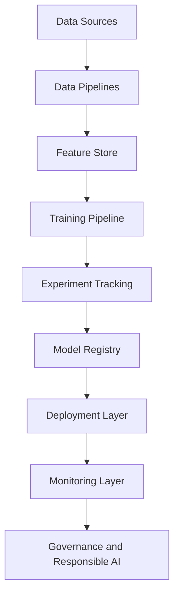
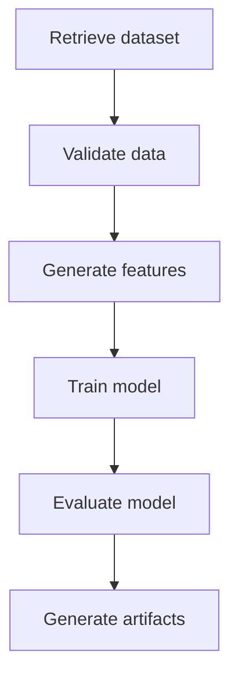

# MLOps Architecture

This notebook introduces the main layers of an enterprise MLOps architecture.

It uses a simplified credit scoring platform as a running example.

## Learning objectives

By the end of this notebook, you will be able to:

- Identify the main layers of an MLOps architecture.
- Map ML lifecycle stages to technical components.
- Understand the role of data pipelines, feature stores, experiment tracking, model registries, deployment, monitoring, and governance.
- Design a simple target architecture for a credit scoring platform.

## Setup

```python
import pandas as pd
import matplotlib.pyplot as plt

```

## Reference MLOps Architecture

A typical enterprise MLOps architecture includes the following layers:



```python
architecture_layers = pd.DataFrame({
    "layer": [
        "Data Sources",
        "Data Pipelines",
        "Feature Store",
        "Training Pipeline",
        "Experiment Tracking",
        "Model Registry",
        "Deployment Layer",
        "Monitoring Layer",
        "Governance and Responsible AI"
    ],
    "purpose": [
        "Provide raw data for model development and inference.",
        "Ingest, clean, validate, and transform data.",
        "Store and serve reusable features consistently.",
        "Automate model training and evaluation.",
        "Track parameters, metrics, artifacts, and metadata.",
        "Manage model versions, approvals, and lifecycle stages.",
        "Serve models through batch jobs or APIs.",
        "Track operational, data, model, and business metrics.",
        "Ensure auditability, fairness, explainability, and compliance."
    ]
})

architecture_layers

```

## Data Sources Layer

The data sources layer provides the raw information required to train and operate ML models.

For credit scoring, typical sources include:

* Loan application data.
* Customer profile data.
* Credit bureau data.
* Payment history.
* Macroeconomic indicators.

| Source | Example variables | Risk |
| :--- | :--- | :--- |
| Loan applications | Requested amount, loan duration, loan purpose | Incomplete applications |
| Customer profiles | Age, income, employment status | Outdated customer records |
| Credit bureau | Credit utilization, existing debt, inquiries | External provider dependency |
| Payment history | Late payments, defaults, repayment behavior | Historical data quality issues |
| Macroeconomic data | Unemployment rate, inflation, interest rates | Low refresh frequency |


### Exercise

For each data source, define one data quality rule.

Example:

```text
Income must be positive and not missing.

```

## Data Pipeline Layer

Data pipelines transform raw data into analytical datasets.

Typical steps:

1. Data ingestion.
2. Schema validation.
3. Data cleaning.
4. Data integration.
5. Feature preparation.
6. Dataset publication.

| Step | Control |
| :--- | :--- |
| Ingestion | Check source availability |
| Schema validation | Check expected columns and types |
| Cleaning | Handle missing values and outliers |
| Integration | Join sources using stable keys |
| Feature preparation | Apply documented transformations |
| Dataset publication | Assign dataset version |


## Feature Store Layer

A feature store provides a centralized repository for reusable ML features.

Its main objective is to reduce inconsistencies between training and inference.

Common problems without a feature store:

* Duplicate feature logic.
* Inconsistent definitions.
* Training-serving skew.
* Poor metadata.

| Feature | Description | Serving mode |
| :--- | :--- | :--- |
| debt_to_income_ratio | Total debt divided by customer income | offline and online |
| credit_utilization_rate | Used credit divided by available credit | offline and online |
| number_of_recent_inquiries | Number of credit inquiries in recent period | offline and online |
| missed_payment_count | Number of missed payments over a defined window | offline |
| average_account_age | Average age of open credit accounts | offline |


## Training Pipeline Layer

The training pipeline automates model development.

Typical stages:


| Stage | Output |
| :--- | :--- |
| Dataset retrieval | Versioned dataset |
| Data validation | Validation report |
| Feature generation | Training matrix |
| Model training | Trained model |
| Model evaluation | Metrics and plots |
| Artifact generation | Model file and reports |

## Experiment Tracking Layer

Experiment tracking records the metadata needed to reproduce and compare model runs.

Typical tracked information:

* Parameters.
* Metrics.
* Dataset versions.
* Feature versions.
* Artifacts.
* Execution timestamp.
* Author.

| Run id | Algorithm | Dataset version | AUC | Status |
| :--- | :--- | :--- | :---: | :--- |
| run_003 | Gradient Boosting | credit_v2 | 0.84 | best |
| run_002 | Random Forest | credit_v1 | 0.82 | candidate |
| run_001 | Logistic Regression | credit_v1 | 0.78 | archived |


## Model Registry Layer

A model registry manages model versions and lifecycle stages.

Typical stages:


| Model name | Version | AUC | Stage | Approved by |
| :--- | :---: | :---: | :--- | :--- |
| credit_scoring_model | 1.0 | 0.78 | Archived | Model Risk |
| credit_scoring_model | 1.1 | 0.82 | Staging | Model Risk |
| credit_scoring_model | 2.0 | 0.84 | Production | Credit Committee |


## Deployment Layer

The deployment layer makes the model available to business systems.

Common deployment patterns:

* Batch scoring.
* Real-time REST API.
* Streaming inference.
* Embedded model execution.

| Pattern | Latency | Example |
| :--- | :--- | :--- |
| Batch scoring | Low requirement | Monthly portfolio scoring |
| Real-time API | Low latency required | Credit application decision |
| Streaming inference | Very low latency required | Real-time fraud detection |

## Monitoring Layer

Monitoring must cover several dimensions:

* Operational monitoring.
* Data monitoring.
* Model monitoring.
* Business monitoring.

| Monitoring type | Metric | Example threshold |
| :--- | :--- | :--- |
| Operational | Latency | < 200 ms |
| Operational | Error rate | < 1% |
| Data | Missing value rate | < 5% |
| Data | Feature drift | PSI < 0.2 |
| Model | ROC-AUC | > 0.75 |
| Business | Default rate | Within risk appetite |


```python
months = list(range(1, 13))
auc_values = [0.84, 0.84, 0.83, 0.82, 0.81, 0.80, 0.78, 0.76, 0.74, 0.72, 0.69, 0.66]

plt.figure(figsize=(8, 4))
plt.plot(months, auc_values, marker="o")
plt.axhline(0.75, linestyle="--", label="Alert threshold")
plt.title("Example Monitoring: AUC Degradation")
plt.xlabel("Month")
plt.ylabel("AUC")
plt.legend()
plt.tight_layout()
plt.show()

```

## Governance and Responsible AI Layer

Governance ensures that models are traceable, auditable, explainable, and compliant.

Responsible AI adds controls related to:

* Fairness.
* Explainability.
* Transparency.
* Accountability.
* Privacy.

| Control | Purpose |
| :--- | :--- |
| Model documentation | Describe model purpose, data, assumptions, and limitations |
| Validation report | Provide independent review evidence |
| Approval workflow | Control production deployment |
| Audit trail | Trace lifecycle decisions |
| Fairness assessment | Detect group disparities |
| Explainability report | Explain global and local predictions |

## Architecture Mapping

The table below maps architecture layers to typical tools.

| Layer | Example tools |
| :--- | :--- |
| Source Control | Git, GitHub |
| Data Versioning | DVC, Delta Lake, LakeFS |
| Feature Store | Feast, Databricks Feature Store |
| Experiment Tracking | MLflow, Azure ML, Weights & Biases |
| Model Registry | MLflow Registry, Azure ML Registry |
| Containerization | Docker |
| CI/CD | GitHub Actions, Azure DevOps |
| Deployment | Azure ML Endpoints, Kubernetes, FastAPI |
| Monitoring | Prometheus, Grafana, Evidently AI |
| Responsible AI | SHAP, Fairlearn, Responsible AI Dashboard |

## Architecture Design Exercise

Design a target architecture for a credit scoring platform.

Your architecture should specify:

1. Data sources.
2. Data pipeline controls.
3. Feature store requirements.
4. Training pipeline stages.
5. Experiment tracking information.
6. Model registry workflow.
7. Deployment pattern.
8. Monitoring metrics.
9. Governance controls.

| Component | Student answer |
| :--- | :--- |
| Data Sources | |
| Data Pipelines | |
| Feature Store | |
| Training Pipeline | |
| Experiment Tracking | |
| Model Registry | |
| Deployment | |
| Monitoring | |
| Governance | |

## Key Takeaways

* MLOps architecture connects business, data, models, deployment, monitoring, and governance.
* Each architectural layer has a specific responsibility.
* Experiment tracking and model registries are central to reproducibility and auditability.
* Deployment requires packaging, release strategy, and monitoring.
* Governance and Responsible AI must be integrated into the architecture from the beginning.
